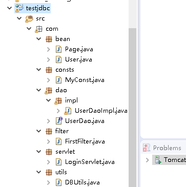
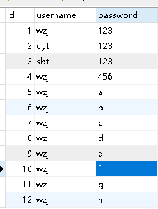
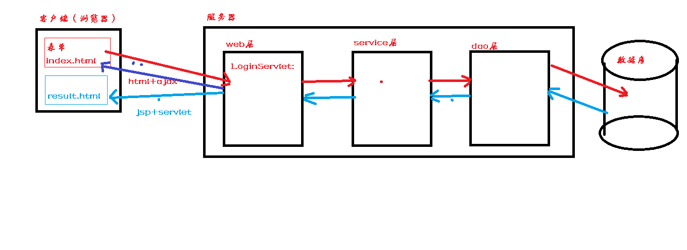

# 1.javaWeb小案例

##  一：我为什么要写这个小案例

我发现我学了那么久,如果不参考之前的代码,我居然写一个简单的

从前端页面--->后端(servlet)--->数据库的增删改查和分页的小案例,都挺费劲

有些东西,看着是简单,感觉自己全都会,但那种感觉其实告诉你,你没有完全真正的会,

完全真正的会,是你拍着胸膛装逼的说,这个是真的**simple**

## 二：能学到什么?

 - **对整个javaweb的执行流程有个基本的认识**
 - **加强之前对web流程的思维**

- **加强自己的编码能力**

## 三：环境搭建

eclipse

tomcat：8.5

涉及到jdbc和json: 用了

- mysql-connector-java-5.1.45-bin.jar
- fastjson-1.2.5.jar

## 三：案列项目图

数据库中的表就一个 user,然后数据如下

大概流程图

**注意：现在一般是 jsp + servlet 或者 html(ajax) + JQ + Js + Servlet**
